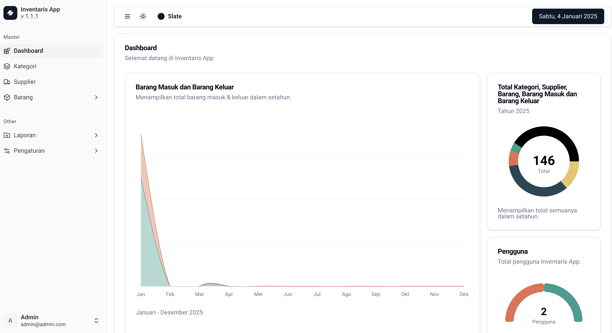

# Inventaris App

<p align="justify">Inventaris App adalah aplikasi manajemen inventaris yang dirancang untuk membantu mengelola aset dan barang dengan efisien. Aplikasi ini menyediakan fitur untuk menambah, mengedit, menghapus, dan memantau barang, pengguna, serta kategori inventaris. Dibangun dengan Laravel sebagai backend dan ReactJs untuk frontend, aplikasi ini mengutamakan kecepatan, kemudahan penggunaan, dan fleksibilitas.
</p>

## Preview



## Authors

- [@haykal-fe-verd](https://github.com/haykal-fe-verd)

## Teknologi

- [Laravel](https://laravel.com/)
- [InertiaJs](https://inertiajs.com/)
- [ReactJs](https://react.dev/)
- [Tailwindcss](https://tailwindcss.com/)
- [ShadcnUi](https://ui.shadcn.com/)

## Fitur

- Light/dark mode.
- Color mode.
- Live notification.
- Record setiap aktivitas user.
- Manajemen User.
- Kategori.
- Supplier.
- Barang.
- Barang Masuk.
- Barang Keluar.
- Laporan.

## Instalasi

- Clone repository

```bash
  https://github.com/haykal-fe-verd/inventaris-app.git
```

- Masuk kedalam repository

```bash
  cd inventaris-app
```

- Buat database

- Copy .env

```bash
  cp .env.example .env
```

- Ubah konfigurasi .env

- Install depedency php

```bash
  composer install
```

- Install depedency javascript

```bash
  npm install
```

- Generate keyy

```bash
  php artisan key:generate
```

- Link storage ke public

```bash
  php artisan storage:link
```

- Menjalankan migrasi dan seeder

```bash
  php artisan migrate:fresh --seed
```

- Menjalankan server php

```bash
  php artisan serve
```

- Menjalankan server frontend

```bash
  npm run dev
```

- Menjalankan server notifikasi

```bash
  php artisan reverb:start
```

## Lisensi

The Laravel framework is open-sourced software licensed under the [MIT license](https://opensource.org/licenses/MIT).
